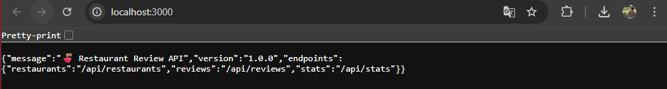
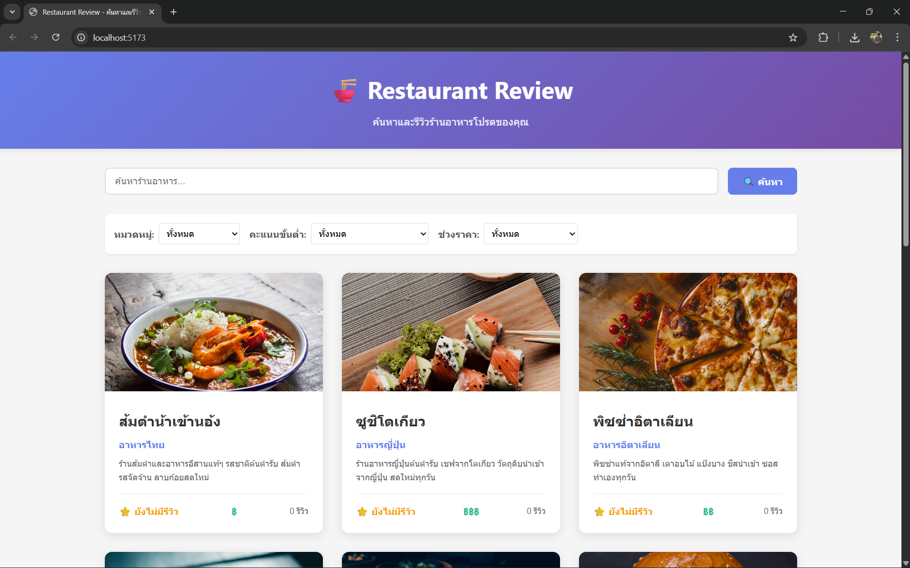
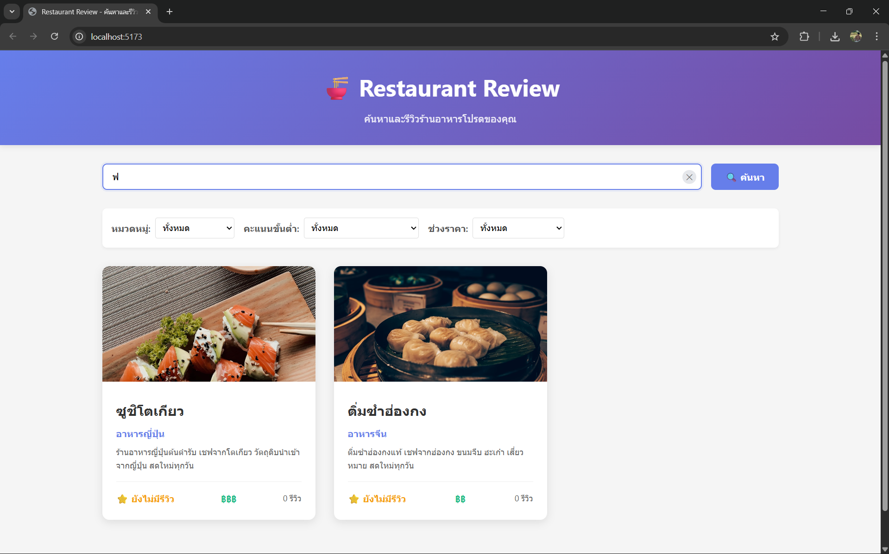
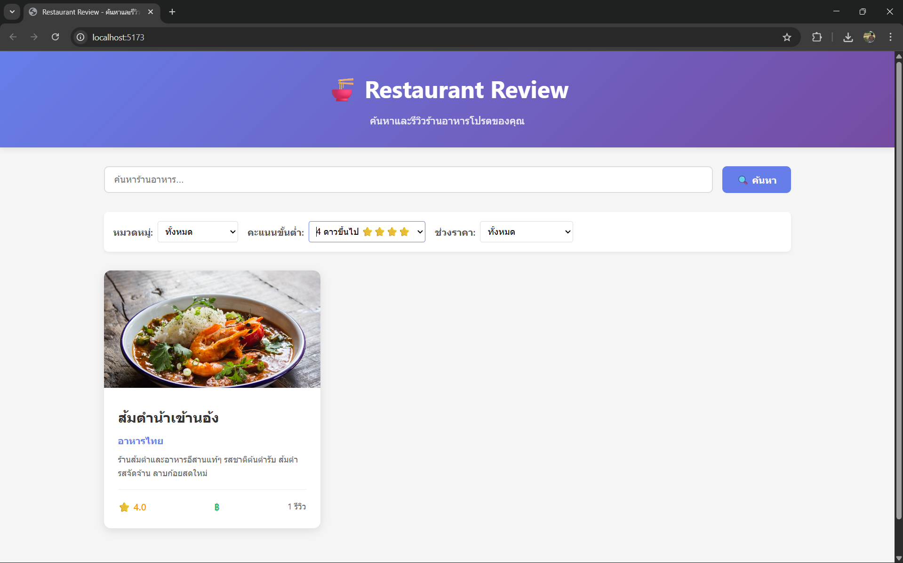
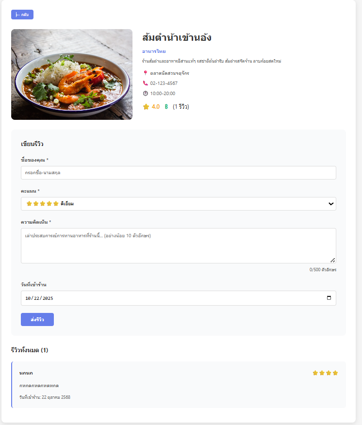
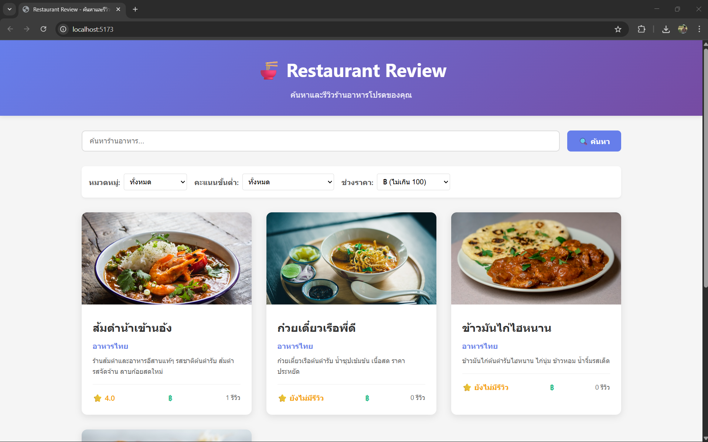

## 🧑‍💻 สร้างโดย
**Tawan Tippkun (ตาวัน ทิพคุณ)**  
หลักสูตรวิศวกรรมซอฟต์แวร์ มทร.ล้านนา เชียงใหม่  

---

# 🍜 Restaurant Review App

แอปพลิเคชันเว็บสำหรับ **ค้นหาและรีวิวร้านอาหาร**
พัฒนาโดยใช้ **React (Frontend)** + **Express (Backend)**

---

## 📸 ตัวอย่างหน้าจอการทำงาน

| หน้า | ตัวอย่างภาพ |
|------|---------------|
| Backend API Endpoint |  |
| หน้าแรกแสดงร้านอาหารทั้งหมด |  |
| การค้นหาด้วยคำค้นหา |  |
| การกรองร้านอาหารตามคะแนน |  |
| หน้ารายละเอียดร้าน + รีวิว |  |
| การกรองร้านอาหารตามราคา |  |

---

## 🧩 โครงสร้างโปรเจกต์

```
restaurant-review-app/
├── backend/           # REST API (Express)
│   ├── routes/        # restaurants.js, reviews.js
│   ├── utils/         # fileManager.js
│   ├── middleware/    # validation.js
│   ├── data/          # restaurants.json, reviews.json
│   └── server.js
│
├── frontend/          # React + Vite
│   ├── src/
│   │   ├── components/  # RestaurantList, Detail, ReviewForm, etc.
│   │   ├── services/    # api.js
│   │   ├── App.jsx
│   │   └── main.jsx
│   └── vite.config.js
│
└── screenshots/       # ภาพแสดงผลใน README
```

---

## ⚙️ วิธีติดตั้งและใช้งาน

### 1️⃣ ติดตั้ง Backend
```bash
cd backend
npm install
cp .env.example .env
npm run dev
```
> เซิร์ฟเวอร์จะรันที่ `http://localhost:3000`

### 2️⃣ ติดตั้ง Frontend
```bash
cd frontend
npm install
npm run dev
```
> เปิดในเบราว์เซอร์ที่ `http://localhost:5173`

---

## 🌐 API Endpoints

| Endpoint | Method | Description |
|-----------|--------|-------------|
| `/api/restaurants` | GET | ดึงรายการร้านอาหารทั้งหมด |
| `/api/restaurants/:id` | GET | ดึงข้อมูลร้านอาหารตาม ID |
| `/api/reviews/:restaurantId` | GET | ดึงรีวิวทั้งหมดของร้านนั้น |
| `/api/reviews` | POST | เพิ่มรีวิวใหม่ |
| `/api/stats` | GET | ดึงสถิติรวมของระบบ |

---

## 🧠 คุณสมบัติหลัก

✅ ค้นหาชื่อร้านอาหารแบบ Real-time  
✅ กรองตามหมวดหมู่, ช่วงราคา, และคะแนน  
✅ แสดงรายละเอียดร้าน + รีวิว  
✅ เพิ่มรีวิวพร้อม Validation  
✅ Responsive UI (รองรับมือถือ)